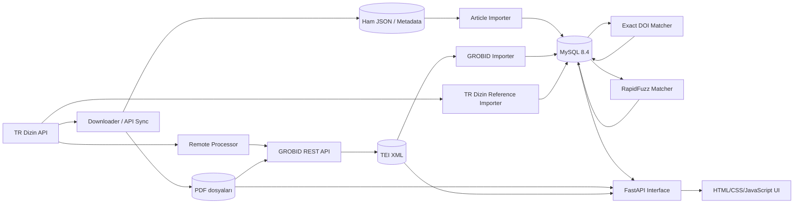
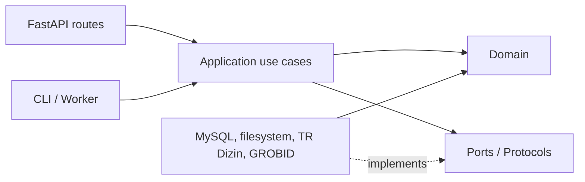

# TR Dizin–GROBID Projesi Mimari Analiz Raporu

**İnceleme tarihi:** 22 Temmuz 2026  
**İnceleme türü:** Statik kod, yapılandırma, şema ve yerel çalışma çıktıları analizi  
**Amaç:** Mevcut sistemi belgelemek, riskleri görünür kılmak ve Clean Architecture yönünde kontrollü bir yeniden düzenleme için başlangıç noktası oluşturmak.

## 1. Yönetici özeti

Bu proje, TR Dizin'deki akademik yayınları toplayan, PDF'leri GROBID ile TEI XML'e dönüştüren, TR Dizin ve GROBID kaynakçalarını MySQL'e aktaran, DOI ve metin benzerliği üzerinden eşleştiren ve sonuçları FastAPI tabanlı bir web arayüzünde sunan bir **ETL/veri işleme sistemi**dir.

Sistem şu anda klasik katmanlı veya Clean Architecture biçiminde değildir. En doğru tanım, Docker Compose ile orkestre edilen, çoğu tek seferlik çalışan Python betiklerinden oluşan **modüler monolitik veri hattı**dır. Servisler süreç seviyesinde ayrılmıştır; fakat ortak domain modeli, uygulama servisleri, repository portları, merkezi yapılandırma, migration sistemi ve ortak gözlemlenebilirlik katmanı yoktur.

Güçlü tarafları:

- İndirme, GROBID işleme, içe aktarma, eşleştirme ve sunum işleri operasyonel olarak ayrılmıştır.
- Uzun işlemlerde devam etme, atlama, batch/limit, retry ve ilerleme kaydı düşünülmüştür.
- Ham veri korunur; PDF, API JSON'u ve TEI XML geriye dönük denetlenebilir.
- Veritabanında yabancı anahtarlar, bazı unique constraint'ler ve indeksler vardır.
- DOI kesin eşleşmesi ile fuzzy metin eşleşmesinin ayrılması doğru bir yaklaşımdır.
- Docker Compose, tüm yerel bağımlılıkları tekrar üretilebilir biçimde bir araya getirir.

Başlıca riskler:

- `interface/app.py` 1.163 satırdır ve sunum, SQL, dosya erişimi ve harici HTTP işlerini aynı modülde toplar.
- Clean Architecture için açılmış `domain`, `application/ports`, `application/use_cases` ve route paketleri fiilen boştur.
- `reference_matching_progress` çalışan kodda kullanılır, fakat `database/init/001_schema.sql` içinde oluşturulmaz. Temiz veritabanı kurulumu eksik şemayla başlayabilir.
- Şema migration aracı yoktur. `docker-entrypoint-initdb.d` yalnızca boş MySQL data dizininde çalışır; sonraki şema değişikliklerini yönetmez.
- Bağımlılık sürümleri sabitlenmemiştir; aynı Docker build'i gelecekte farklı paket sürümleri üretebilir.
- Otomatik test, lint, type-check ve CI yapılandırması bulunmamaktadır.
- Yapısal loglama yoktur. Betikler ağırlıkla `print`, CSV manifestleri ve Docker stdout kullanır.
- Web API'de kimlik doğrulama, yetkilendirme, rate limiting ve belirgin bir güvenlik katmanı yoktur.
- Aynı mantığın farklı betiklerde tekrarları vardır: MySQL bağlantısı, retry, TR Dizin URL üretimi, normalizasyon ve ayar okuma.
- Depo çalışma alanında büyük hacimli türetilmiş veri ve çok sayıda tarihsel kopya vardır. `.gitignore` bunların çoğunu engellese de kaynak ağacını ve işletimi karmaşıklaştırır.

## 2. İnceleme kapsamı ve sınırlamalar

İncelenen başlıca alanlar:

- `docker-compose.yml` ve bütün Dockerfile'lar
- Python kaynak kodları
- FastAPI endpointleri ve HTML/JavaScript arayüzü
- MySQL başlangıç şeması ve SQL betikleri
- TR Dizin ve GROBID entegrasyonları
- Yerel `data/` altındaki dosya, manifest ve hata raporları
- Bağımlılık dosyaları, `.gitignore`, README ve depo hijyeni

36 aktif Python dosyasının sözdizimi `ast.parse` ile kontrol edilmiş ve hata bulunmamıştır. `docker compose config --services` yapılandırmayı başarıyla çözmüş ve 16 servis tespit etmiştir.

Docker daemon socket'ine çalışma ortamından erişim izni olmadığı için çalışan container durumları ve canlı MySQL tablo sayıları doğrulanamamıştır. Bu nedenle veritabanı çalışma zamanı istatistikleri yerine şema, kod sorguları, dosya sayıları ve mevcut CSV raporları kullanılmıştır.

## 3. Sistem bağlamı



Temel tasarım tercihi, ham ve işlenmiş verinin birlikte korunmasıdır:

1. TR Dizin'den gelen ham sayfalar JSON olarak saklanır.
2. PDF'ler yayın kimliğiyle dosya sistemine yazılır.
3. GROBID sonucu TEI XML olarak saklanır.
4. Normalize edilmiş ve sorgulanabilir alanlar MySQL'e aktarılır.
5. Karşılaştırma sonuçları yeniden MySQL'e yazılır.
6. Arayüz hem ilişkisel veriyi hem gerektiğinde ham JSON/XML ve PDF'yi sunar.

Bu yaklaşım araştırma ve denetlenebilirlik için yararlıdır; ancak tek bir “source of truth” yoktur. PDF durumu dosya sistemi, `articles.download_status`, manifest CSV ve bazen `pdf_uuid` üzerinden ayrı ayrı yorumlanmaktadır. XML durumu da dosya sistemi, `grobid_documents.processing_status` ve CSV manifestte temsil edilir. Tutarlılık kurallarının merkezileştirilmesi gerekir.

## 4. Kullanılan teknolojiler

| Teknoloji | Sürüm/durum | Kullanım |
|---|---:|---|
| Python | Docker imajında 3.12 | Bütün veri hattı, API ve orkestrasyon betikleri |
| FastAPI | Sabitlenmemiş | Web/API katmanı |
| Uvicorn | Sabitlenmemiş | ASGI sunucusu |
| MySQL | 8.4 | Kalıcı ilişkisel veri deposu |
| GROBID | 0.8.0 | PDF kaynakçalarını TEI XML'e çıkarma |
| Requests | Sabitlenmemiş | TR Dizin ve GROBID HTTP iletişimi |
| mysql-connector-python | Sabitlenmemiş | MySQL erişimi |
| RapidFuzz | Sabitlenmemiş | Kaynakça benzerlik skorları |
| ElementTree | Python standard library | TEI XML ayrıştırma |
| HTML/CSS/Vanilla JavaScript | Tek büyük template | Web arayüzü |
| Docker / Compose | Compose spec | İzolasyon, ağ, volume ve iş orkestrasyonu |
| SQLite | Arayüzde read-only adapter | Statik/demo dağıtımına yönelik alternatif backend |

Projede ORM, migration framework'ü, görev kuyruğu, cache, mesaj broker'ı veya frontend framework'ü kullanılmamaktadır. SQL sorguları doğrudan Python içinde yazılmıştır.

## 5. Kaynak kodu yapısı ve sorumluluklar

### 5.1 Downloader

`downloader/download_pdfs.py` küçük/sayfalı indirme; `bulk_download_pdfs.py` ise büyük hacimli, kaldığı yerden devam edebilen indirme işidir.

Bulk downloader:

- TR Dizin yayın arama endpointine sayfa ve boyut parametreleriyle gider.
- HTTP retry adapter kullanır.
- API sayfasını `data/metadata/api-pages/page_XXXXX.json` olarak saklar.
- Kayıttan `publicationId`, başlık, DOI, yıl, dergi ve PDF UUID alanlarını çıkarır.
- `api/getFile/{uuid}` çağrısıyla gerçek indirme URL'sini alır.
- PDF içeriğini doğrulayarak `{publication_id}.pdf` biçiminde yazar.
- `bulk_state.json` ile sayfa ve sayaç durumunu tutar.
- Her kayıt için `bulk_download_manifest.csv` satırı ekler.
- Mevcut PDF'leri tarayarak idempotent davranmaya çalışır.

Olumlu taraf, API ham cevabının ve manifestin korunmasıdır. Risk, 856 satırlık betiğin API client, mapping, dosya repository, state store ve workflow runner rollerini birlikte üstlenmesidir.

### 5.2 Processor ve GROBID

`process_pdfs.py` yerel PDF'leri, `process_remote_pdfs.py` ise MySQL'de kayıtlı PDF UUID üzerinden uzak PDF'leri işler.

GROBID entegrasyonu:

- Hazırlık kontrolü: `GET /api/isalive`
- Kaynakça çıkarımı: `POST /api/processReferences`
- PDF multipart form-data olarak gönderilir.
- Başarılı yanıt `{publication_id}.tei.xml` biçiminde saklanır.
- TEI içindeki kaynak sayısı kontrol edilir.
- Sonuç `grobid_manifest.csv` dosyasına yazılır.

`classify_failed_pdfs.py`, başarısız PDF'leri yeniden GROBID'e gönderip HTTP durumu, content type ve cevap boyutuna göre sınıflandırır. Mevcut sınıflandırma raporunda `no_content` örnekleri vardır; 204 yanıtı “okunabilir kaynakça/metin yok” şeklinde yorumlanır. OCR pipeline'ı uygulanmış değildir; sadece OCR gereksinimi veya işlenememe sınıflandırmasına yaklaşan bir teşhis vardır.

### 5.3 Importer'lar

- `import_articles.py`: Diskteki API sayfa JSON'larını `articles` tablosuna upsert eder.
- `sync_trdizin_api.py`: Disk ara adımı olmadan TR Dizin API'den makaleleri doğrudan MySQL'e senkronize eder.
- `import_trdizin_references.py`: `articles.trdizin_raw_json` içindeki kaynakçaları ayrıştırıp `trdizin_references` tablosuna yazar.
- `import_grobid.py`: TEI XML'i ayrıştırıp `grobid_documents` ve `grobid_references` tablolarına aktarır.
- `import_failed_statuses.py`: CSV hata sınıflandırmasını `grobid_documents.processing_status/message` alanlarına taşır.

İki paralel giriş yolu vardır: dosya tabanlı pipeline ve doğrudan API tabanlı pipeline. Bunlar aynı iş kurallarını paylaşan sınıflar yerine ayrı betikler halinde gelişmiştir; davranış sapması riski doğurur.

### 5.4 Worker'lar

`worker/run_pipeline.py`, yerel PDF akışında alt betikleri subprocess olarak çalıştırır. PDF ve XML kimlik kümelerini karşılaştırır, batch halinde GROBID işleme ve XML importu yapar, ilerleme olmazsa belirli turdan sonra durur.

`worker/run_api_pipeline.py`, API tabanlı akışta kabaca şu sırayı koordine eder:

1. Makale senkronizasyonu
2. Aday makalelerin seçimi
3. Uzak PDF'nin işlenmesi
4. TR Dizin kaynakçalarının importu
5. GROBID XML importu
6. Kesin DOI eşleştirmesi
7. Metin eşleştirmesi

Bu worker'lar gerçek bir job queue değildir. Kalıcı görev sahipliği, distributed lock, visibility timeout, per-job retry/dead-letter queue yoktur. Aynı servisin birden fazla replica ile çalıştırılması yarış koşullarına yol açabilir.

### 5.5 FastAPI arayüzü

Arayüz, server-render edilmiş bir template uygulaması değildir; `index.html` doğrudan servis edilir ve içindeki JavaScript JSON endpointlerini çağırır. Başlıca endpointler:

| Endpoint | Görev |
|---|---|
| `GET /` | Tek sayfa arayüzü döndürür |
| `GET /api/health` | DB ve veri sayılarıyla sağlık/özet bilgisi |
| `GET /api/articles` | Eski istemciyle uyumlu makale listesi |
| `GET /api/articles/search` | Arama, filtreleme ve sayfalama |
| `GET /api/articles/{id}` | Makale detayı |
| `GET /api/articles/{id}/trdizin-references` | TR Dizin kaynakçaları |
| `GET /api/articles/{id}/grobid-references` | GROBID kaynakçaları; eski `/references` alias'ı da var |
| `GET /api/articles/{id}/comparison` | Eşleşme ve karşılaştırma görünümü |
| `GET /api/articles/{id}/trdizin-json` | Ham TR Dizin JSON'u |
| `GET /api/articles/{id}/grobid-tei` | DB'deki TEI XML |
| `GET /pdfs/{id}.pdf` | Yerel veya TR Dizin'den proxy edilen PDF |
| `GET /tei/{id}.xml` | Dosya sistemindeki TEI XML |

Yerel PDF yoksa API, MySQL'den `pdf_uuid` alıp TR Dizin'den URL çözer ve PDF'yi streaming proxy olarak sunar. Range header karşı servise iletilir; bu, tarayıcı PDF görüntüleyicisi için doğru bir ayrıntıdır. Buna karşılık senkron `requests` çağrılarının senkron FastAPI handler içinde çalışması worker kapasitesini uzun süre meşgul edebilir.

Arayüzde Clean Architecture yönünde ilk iskelet vardır:

```text
trdizin_app/
├── domain/                  # boş
├── application/
│   ├── ports/               # boş
│   └── use_cases/           # boş
├── infrastructure/
│   ├── config/settings.py   # kullanılan ayarlar
│   └── database/            # MySQL/SQLite connection factory
└── presentation/api/routes/ # boş
```

Yani isimsel katmanlar açılmış fakat bağımlılık yönü henüz uygulanmamıştır. `app.py`, infrastructure içindeki settings ve connection factory'yi kullanır; geri kalan domain ve application katmanları devre dışıdır.

## 6. Harici API'ler

### 6.1 TR Dizin

Kodda kullanılan servisler:

- `https://search.trdizin.gov.tr/api/defaultSearch/publication/`: yayın arama/sayfalama
- `https://search.trdizin.gov.tr/api/getFile/{pdf_uuid}?showViewer=false`: PDF indirme URL'si çözümleme
- `getFile` cevabından alınan uzak URL: gerçek PDF içeriğini indirme

API için resmi bir typed client veya sözleşme modeli yoktur. JSON alanları sözlük erişimiyle ve çeşitli fallback'lerle okunur. API yanıt yapısı değişirse hata çoğunlukla runtime'da ortaya çıkar. API anahtarı görünmemektedir; servis açık endpoint olarak kullanılmıştır. `User-Agent`, timeout ve bazı retry davranışları vardır, ancak merkezi rate-limit/backoff politikası yoktur.

Öneri: `TrDizinGateway` portu ve `RequestsTrDizinClient` adapter'ı oluşturulmalı; Pydantic response modelleri, timeout/retry/backoff ve contract testleri tek yerde toplanmalıdır.

### 6.2 GROBID

GROBID, Compose iç ağında `http://grobid:8070` adresindedir. Host üzerinde de 8070 portu açılmıştır. Uygulama sadece iki endpointi kullanır: sağlık ve `processReferences`. GROBID 0.8.0 sürümü sabitlenmiştir.

Öneri: `ReferenceExtractor` portu oluşturulmalı; HTTP ayrıntıları `GrobidClient` adapter'ına taşınmalı. 204, timeout, geçersiz XML, sıfır kaynakça ve 5xx için domain seviyesinde açık hata tipleri tanımlanmalıdır.

## 7. Veri modeli ve veri yönetimi

### 7.1 Mevcut tablolar

`articles`

- Birincil anahtar `publication_id`.
- Makale başlığı, DOI, yıl, dergi, PDF UUID/path/size ve indirme durumu tutulur.
- Bütün TR Dizin kaydı `trdizin_raw_json` alanında da korunur.

`trdizin_references`

- Makale ve kaynakça indeksi unique'dir.
- Ham kaynakça, başlık, yazar JSON'u, yıl, dergi, DOI ve ham JSON saklanır.
- `articles` tablosuna cascade delete yabancı anahtarı vardır.

`grobid_documents`

- Belge başına TEI path, tam TEI XML, kaynakça sayısı, processing status/message ve zaman bilgisi vardır.

`grobid_references`

- TEI'den çıkarılan her kaynakça için raw text ve normalize edilebilir bibliyografik alanlar tutulur.

`comparison_results`

- TR Dizin ve GROBID kaynakça indekslerini, karşılaştırılan alanı, iki değeri, skoru ve durumu saklar.

Çalışan kod ayrıca `reference_matching_progress` tablosunu okur ve yazar. Bu tablo başlangıç SQL'inde yoktur. Bu, belgelenmemiş ve migration dışı bir şema bağımlılığıdır.

### 7.2 Saklama katmanları

| Katman | İçerik | Avantaj | Risk |
|---|---|---|---|
| Dosya sistemi | PDF | Büyük binary'yi DB dışında tutar | DB durumu ile sapabilir |
| Dosya sistemi | Ham API JSON | Yeniden işleme ve audit | 265 MB yerel metadata, yaşam döngüsü yok |
| Dosya sistemi | TEI XML | GROBID ham çıktısı korunur | Aynı XML ayrıca DB'de tutulur |
| CSV/JSON | Manifest, state, hata | Basit ve incelenebilir | Eşzamanlılık ve sorgulama zayıf |
| MySQL JSON/LONGTEXT | Ham JSON, TEI ve alanlar | API sorguları kolay | Veri tekrarı ve DB büyümesi |
| Statik export | `docs/`, `deploy/` | Sunucusuz demo/yayın | Büyük türetilmiş artifact yönetimi |

Yerel durum fotoğrafı:

- 10.000 PDF, yaklaşık 11 GB
- 9.889 TEI XML, yaklaşık 436 MB
- 105 metadata dosyası, yaklaşık 265 MB
- 4 log/rapor dosyası, yaklaşık 4,7 MB
- `docs/` yaklaşık 597 MB
- `deploy/` yaklaşık 3,0 GB
- Bir MySQL sıkıştırılmış backup'ı yaklaşık 250 MB

Bu sayılar pipeline'ın büyük ölçüde çalıştığını, fakat artifact/retention politikasının önemli hale geldiğini gösterir.

### 7.3 Tutarlılık ve idempotency

İyi uygulamalar:

- `articles` publication ID üzerinden upsert edilir.
- Kaynakça tablolarında `(publication_id, reference_index)` unique'dir.
- Var olan PDF ve XML'ler atlanabilir.
- Importer'larda missing-only ve limit seçenekleri vardır.
- Worker ilerleme yoksa sonsuz döngüye girmemeye çalışır.

Eksikler:

- Dosya yazımı ile DB transaction aynı atomik sınırda değildir.
- XML dosyası oluşup DB importu başarısız olabilir veya tersi olabilir.
- Manifest CSV ile DB'nin hangisinin otorite olduğu açık değildir.
- Job lease/lock olmadığı için eşzamanlı worker duplicate iş yapabilir.
- Status alanları serbest `VARCHAR`; enum/check constraint yoktur.
- Veri lineage ve pipeline run tabloları yoktur.
- Şema sürümü tutulmaz.

## 8. Kaynakça analiz ve eşleştirme algoritması

### 8.1 DOI eşleştirmesi

Önce DOI tabanlı kesin eşleşme yapılır. DOI metinlerinde `doi.org`, `dx.doi.org` ve HTTP önekleri normalize edilir. Aynı makale içindeki TR Dizin ve GROBID kayıtlarının normalize DOI'leri eşitse `comparison_results` içine `field_name='doi'`, `comparison_status='exact_match'` olarak yazılır.

Bu sıra önemlidir: kesin DOI eşleşen indeksler sonraki fuzzy eşleşmeden çıkarılır. Böylece yüksek güvenli eşleşmeler korunur.

Riskler:

- DOI normalizasyonu SQL ve/veya farklı Python alanlarında tekrar eder.
- DOI syntax doğrulaması merkezi değildir.
- Bir tarafta duplicate DOI olduğunda bire-bir eşleşme semantiği ayrıca belgelenmelidir.

### 8.2 Metin normalizasyonu

Kaynakça metni:

1. Unicode NFKC ile normalize edilir.
2. Küçük harfe çevrilir.
3. DOI/HTTP URL önekleri temizlenir.
4. Alfanümerik olmayan karakterler boşluğa çevrilir.
5. Çoklu boşluklar tek boşluğa indirilir.

Dil-spesifik transliterasyon, stop-word, yazar adı normalizasyonu veya dergi kısaltma sözlüğü yoktur. Türkçe `I/İ` ve farklı alfabeler için basit `lower()` davranışı ölçülmelidir.

### 8.3 Skor

RapidFuzz üzerinden üç skor birleştirilir:

```text
toplam = token_set_ratio × 0,45
       + token_sort_ratio × 0,35
       + ratio × 0,20
```

- Yıllar eşitse +5 puan
- Yıllar farklıysa -8 puan
- Kısa/uzun metin oranı 0,45'ten küçükse -8 puan
- Sonuç 0–100 aralığına kırpılır
- Varsayılan kabul eşiği 82'dir

### 8.4 Aday seçimi

Her TR Dizin–GROBID çifti için skor matrisi oluşturulur. Bir eşleşmenin kabulü için:

- İki tarafın da karşılıklı en iyi adayı olması,
- Skorun eşikten yüksek olması,
- Her iki yönde en iyi ile ikinci en iyi aday farkının varsayılan 3 puandan büyük olması gerekir.

Bu karşılıklı en iyi eşleşme yaklaşımı ambiguity'yi azaltır. Ancak karmaşıklık makale başına `O(T × G)`'dir. Tipik kaynakça sayılarında kabul edilebilir olsa da ölçüm yoktur.

### 8.5 Hata sınıflandırması

`partial_ratio >= 95` ve uzunluk oranı `< 0,80` ise:

- GROBID metni daha uzunsa `grobid_merged`
- GROBID metni daha kısaysa `grobid_partial`
- Diğer durumda `text_match_clean`

Bu kurallar sezgiseldir ve kod içinde sabittir. Ground-truth etiketli veri, precision/recall ölçümü veya threshold kalibrasyon testi bulunmamaktadır. Bilimsel sonuç üretilecekse eşiklerin deneysel doğrulaması ve algoritma sürümünün sonuçlarla birlikte saklanması gerekir.

## 9. Docker'ın görevi ve kullanım biçimi

Docker burada yalnızca paketleme değil, sistemin ana orkestrasyon mekanizmasıdır:

- GROBID ve MySQL gibi ağır bağımlılıkları yerel kurulumdan ayırır.
- Her Python işini ayrı image/command olarak çalıştırır.
- Compose DNS sayesinde servisler `mysql` ve `grobid` adlarıyla haberleşir.
- Bind mount'larla PDF/XML/metadata/log/MySQL verisi host üzerinde kalıcı tutulur.
- MySQL healthcheck ile importer ve interface başlangıcı koordine edilir.
- Tek seferlik batch işleri `restart: "no"`, uzun yaşayan servisler `unless-stopped` kullanır.
- Ortam değişkenleriyle batch boyutu, limit, eşik ve bağlantı bilgileri enjekte edilir.

16 Compose servisi vardır:

| Grup | Servisler | Yaşam biçimi |
|---|---|---|
| Altyapı | `mysql`, `grobid` | Uzun yaşayan |
| Web | `interface` | Uzun yaşayan |
| İndirme | `downloader`, `bulk-downloader` | Batch |
| İşleme | `processor`, `remote-processor`, `failed-grobid-classifier` | Batch |
| Import | `db-importer`, `db-grobid-importer`, `db-trdizin-reference-importer`, `db-grobid-status-importer` | Batch |
| Eşleştirme | `db-reference-matcher`, `db-reference-matcher-full` | Batch |
| Orkestrasyon | `grobid-worker`, `api-pipeline-worker` | Batch/uzun tur |

Volume stratejisi genel olarak doğrudur; salt okunması gereken mount'ların çoğu `:ro` işaretlidir. MySQL portu yalnızca `127.0.0.1:3306` üzerinde açılmıştır; bu iyi bir varsayılandır. Buna karşılık GROBID portu tüm host interface'lerine açılır; yalnızca arayüz/API host erişimi gerekmiyorsa port hiç publish edilmemeli veya localhost'a bağlanmalıdır.

Docker eksikleri:

- Python image ve paketleri digest/sürüm ile tam sabit değildir.
- Non-root kullanıcı tanımlanmamıştır; container süreçleri varsayılan root ile çalışır.
- Python servislerinde healthcheck yoktur.
- CPU/memory limitleri yoktur; GROBID yoğun kaynak tüketebilir.
- Log rotation (`json-file` options) yoktur.
- Compose profiles yoktur; 16 servis tek dosyada operasyonel karmaşa yaratır.
- Tekrarlanan environment ve volume blokları YAML anchor ile sadeleştirilmemiştir.
- Image katmanlarında uygulama kullanıcısı, read-only root filesystem ve capability azaltma yapılmamıştır.
- Secret'lar Compose `.env` interpolation ile aktarılır; Docker secrets veya harici secret manager yoktur.
- MySQL bind mount izin sorunları gözlenmiştir; root dışı dosya envanterinde bazı MySQL dizinleri okunamamıştır.

## 10. Loglama ve gözlemlenebilirlik

### 10.1 Mevcut log/rapor dosyaları

Log dosyaları vardır, fakat klasik uygulama logundan çok işlem manifestidir:

| Dosya | Amaç |
|---|---|
| `data/logs/bulk_download_manifest.csv` | Her PDF indirme denemesi ve sonucu |
| `data/logs/grobid_manifest.csv` | Her GROBID işleme sonucu |
| `data/logs/failed_grobid_final.csv` | Nihai başarısız GROBID işleri |
| `data/logs/failed_grobid_classification.csv` | Başarısızlıkların yeniden sınıflandırılması |
| `data/metadata/download_manifest.csv` | Küçük downloader sonucu |
| `data/metadata/bulk_state.json` | Resume/checkpoint durumu |

Betiklerin çoğu ayrıca `print(..., flush=True)` ile stdout üretir. Docker bunları container loguna yazar; ancak proje bunları dosyaya yönlendirmez ve saklama/rotation politikası tanımlamaz.

### 10.2 Eksik olanlar

- Python `logging` ile seviye bazlı kayıt (`DEBUG/INFO/WARNING/ERROR`) yoktur.
- JSON structured log yoktur.
- Her pipeline çalışmasını bağlayan `run_id`, `correlation_id` ve `publication_id` bağlamı tüm servislerde standart değildir.
- Merkezi log toplama (Loki/ELK/OpenSearch vb.) yoktur.
- Metrics/Prometheus endpointi yoktur.
- İş süresi, throughput, retry, hata oranı, GROBID latency ve queue depth metrikleri yoktur.
- Distributed tracing yoktur.
- Alarm ve SLO tanımı yoktur.
- FastAPI request/access log konfigürasyonu proje içinde yönetilmez; Uvicorn varsayılanına bırakılır.
- CSV dosyaları büyüdükçe rotation/arşivleme yapılmaz.

Önerilen minimum standart:

```json
{
  "timestamp": "...",
  "level": "INFO",
  "service": "grobid-processor",
  "run_id": "...",
  "publication_id": 1448396,
  "event": "reference_extraction_completed",
  "duration_ms": 1832,
  "reference_count": 63
}
```

CSV manifestler audit amaçlı korunabilir; fakat uygulama logunun yerine kullanılmamalıdır.

## 11. Güvenlik değerlendirmesi

- `.env` ve `data/` Git tarafından ignore edilmektedir; gerçek `.env` tracked değildir.
- MySQL host portunun localhost'a bağlanması olumludur.
- Web API'de auth/authz yoktur. Dış ağa açılırsa ham metadata, TEI ve PDF erişimi kontrolsüz kalır.
- GROBID portu hosta genel biçimde publish edilir.
- PDF proxy, DB'deki UUID ve TR Dizin'in döndürdüğü URL'yi kullanır. URL'nin beklenen hostlara ait olduğunu doğrulayan allow-list yoktur; upstream kompromize/yanlış cevap halinde SSRF benzeri risk değerlendirilmelidir.
- Uzak içerik boyutu için açık üst sınır görünmemektedir; çok büyük PDF bellek/disk/işlem tüketebilir.
- Dependency sürümleri sabit olmadığı için supply-chain tekrar üretilebilirliği düşüktür.
- Container'lar non-root değildir.
- SQL değerleri genel olarak parametreli geçirilir. Dinamik tablo adı kullanılan yerde allow-list kontrolü vardır; bu olumlu bir ayrıntıdır.
- API hata cevaplarında bazı DB hata ayrıntılarının dışarı sızma ihtimali ayrıca gözden geçirilmelidir.
- CORS middleware görünmemektedir; aynı origin kullanımında sorun değildir, ayrı frontend planlanırsa açık allow-list gerekir.

## 12. Kod kalitesi ve bakım yapılabilirlik

Aktif kaynaklar yaklaşık 9.774 satırdır. En büyük dosyalar:

- `interface/templates/index.html`: 1.714 satır
- `interface/app.py`: 1.163 satır
- `downloader/bulk_download_pdfs.py`: 856 satır
- `database/importer/match_references.py`: 807 satır
- `database/importer/import_grobid.py`: 655 satır

Belirgin code smell'ler:

- God module / long script
- Tekrarlanan bağlantı ve retry kodu
- Global ortam değişkenleri ve import zamanında ayar yükleme
- SQL'in use-case koduna gömülmesi
- Serbest string status değerleri
- Subprocess ile Python modüllerini birbirine bağlama
- Ayrı betiklerde kopyalanan TR Dizin ve GROBID client davranışı
- Çok sayıda `.before-*`, `.backup`, `.save`, `.accidental-edit` çalışma kopyası
- `__pycache__` dosyalarının çalışma alanında bulunması
- README'nin faydalı fakat gerçek şema/servis evrimiyle senkron kalma riski

Test altyapısı bulunmamıştır. `trdizin_api_test.py` adı test olsa da pytest testi değil, manuel smoke-test betiğidir. Unit, integration, contract, migration ve end-to-end test yoktur.

## 13. Kritik bulgular ve öncelik

| Öncelik | Bulgu | Etki | Öneri |
|---|---|---|---|
| P0 | `reference_matching_progress` başlangıç şemasında yok | Temiz kurulumda health/matcher kırılabilir | Migration ekle, şemayı canlı DB ile karşılaştır |
| P0 | Otomatik test yok | Refactor regresyonu fark edilmez | Önce karakterizasyon testleri |
| P1 | `app.py` çoklu sorumluluk taşıyor | Değişiklik riski ve düşük test edilebilirlik | Route → use case → port → adapter ayrımı |
| P1 | Migration sistemi yok | Şema drift ve tekrarlanamaz deploy | Alembic benzeri kontrollü migration veya versioned SQL runner |
| P1 | Bağımlılıklar sabit değil | Build drift ve supply-chain riski | Hash'li lock dosyası/pin |
| P1 | Job lock/lease yok | Paralel worker duplicate işleyebilir | DB tabanlı claim/lease veya task queue |
| P1 | Structured log/metrics yok | Operasyonel teşhis zayıf | Ortak logging + metrics |
| P1 | API auth yok | Dışa açılırsa veri erişim riski | Ağ sınırı veya auth gateway |
| P2 | Aynı veri dosya/DB/CSV'de tekrar | Tutarsızlık ve kapasite maliyeti | Otorite ve retention politikası |
| P2 | Status'lar serbest string | Geçersiz durumlar | Enum/value object + DB constraint |
| P2 | Eşleştirme eşikleri doğrulanmamış | Araştırma sonucunda ölçüm yanlılığı | Etiketli dataset ve metrikler |
| P2 | Büyük statik/deploy artifactleri | Disk ve release karmaşası | Artifact registry/object storage |
| P3 | Compose tekrarı | Bakım yükü | Profiles, anchors, override dosyaları |

## 14. Önerilen hedef Clean Architecture

Clean Architecture burada her betiği mikroservise çevirmek anlamına gelmemelidir. En uygun ilk hedef, ortak domain/application paketini paylaşan ve CLI/API giriş noktaları ayrı olan **modüler monolit**tir.

```text
src/trdizin_grobid/
├── domain/
│   ├── entities/
│   │   ├── article.py
│   │   ├── reference.py
│   │   ├── document.py
│   │   └── match.py
│   ├── value_objects/
│   │   ├── doi.py
│   │   ├── publication_id.py
│   │   └── processing_status.py
│   ├── services/
│   │   └── reference_matching.py
│   └── errors.py
├── application/
│   ├── ports/
│   │   ├── article_repository.py
│   │   ├── reference_repository.py
│   │   ├── artifact_store.py
│   │   ├── trdizin_gateway.py
│   │   ├── reference_extractor.py
│   │   └── unit_of_work.py
│   ├── commands/
│   │   ├── sync_articles.py
│   │   ├── download_pdf.py
│   │   ├── extract_references.py
│   │   ├── import_references.py
│   │   └── match_references.py
│   └── queries/
│       ├── search_articles.py
│       └── get_comparison.py
├── infrastructure/
│   ├── persistence/mysql/
│   ├── persistence/sqlite/
│   ├── external/trdizin/
│   ├── external/grobid/
│   ├── storage/filesystem/
│   ├── observability/
│   └── config/
├── presentation/
│   ├── api/routes/
│   └── cli/commands/
└── bootstrap.py
```

Bağımlılık yönü:



Temel kural: domain ve application katmanı `requests`, `mysql.connector`, FastAPI, dosya yolu veya Docker hakkında bilgi sahibi olmamalıdır.

## 15. Kademeli dönüşüm planı

### Faz 0 — Güvenlik ağı ve envanter

1. Canlı DB şemasını dump ederek versioned SQL ile karşılaştır.
2. `reference_matching_progress` dahil eksik migration'ları tamamla.
3. Mevcut pipeline'dan küçük, anonimleştirilmiş fixture seti çıkar: 3 başarılı, 1 DOI eşleşmeli, 1 merged, 1 partial, 1 başarısız PDF.
4. Mevcut davranışı kilitleyen characterization testleri yaz.
5. Bağımlılıkları sabitle; Ruff, mypy/pyright ve pytest ekle.
6. Yedek/tarihsel kopyaları Git geçmişine güvenerek kaynak ağacından ayır; bu işlemden önce kullanıcı onayı ve backup doğrulaması gerekir.

### Faz 1 — Ortak çekirdek

1. `PublicationId`, `DOI`, `Reference`, `MatchResult`, status enum'larını oluştur.
2. `normalize_reference`, skor ve sınıflandırma fonksiyonlarını saf domain servisine taşı.
3. Etiketli fixture'larla eşleştirme testleri ekle.
4. Bütün environment değişkenlerini tek Settings modelinde doğrula.
5. Ortak hata hiyerarşisi ve structured logging kur.

Bu faz düşük risklidir; davranış aynı tutulup yalnızca saf mantık çıkarılabilir.

### Faz 2 — Port ve adapter'lar

1. `TrDizinGateway`, `ReferenceExtractor`, repository, artifact store ve unit-of-work protokollerini tanımla.
2. Mevcut Requests/MySQL/filesystem kodunu adapter olarak sar.
3. Tekrarlanan MySQL connect/retry kodunu kaldır.
4. SQL sorgularını repository modüllerine taşı.
5. API client'larda timeout, retry, response validation ve telemetry'yi merkezileştir.

### Faz 3 — Use-case ve giriş noktaları

1. Downloader/importer betiklerini ince CLI wrapper'larına dönüştür.
2. Worker'ın subprocess çağırması yerine application use-case'lerini çağırmasını sağla.
3. FastAPI `app.py`yi route modüllerine böl.
4. Route'larda yalnızca request validation, use-case çağrısı ve response mapping bırak.
5. OpenAPI response modellerini Pydantic ile tanımla.

### Faz 4 — İşletim dayanıklılığı

1. `pipeline_runs` ve `jobs`/lease tabloları ekle veya Celery/RQ/Dramatiq benzeri kuyruk gereksinimini değerlendir.
2. Job idempotency key, attempt count, next retry, error code ve timestamps sakla.
3. Prometheus metrikleri ve health/readiness ayrımı ekle.
4. Log rotation/merkezi log toplamayı kur.
5. Artifact retention ve backup/restore prosedürünü belgele.
6. Container'ları non-root, sınırlı kaynak ve mümkünse read-only filesystem ile sertleştir.

### Faz 5 — Veri ve algoritma kalitesi

1. Ground-truth dataset oluştur.
2. Threshold ve ağırlıkları precision, recall, F1 üzerinden kalibre et.
3. Algoritma sürümünü `comparison_results` veya ayrı match-run kaydında sakla.
4. DOI, yıl, başlık, yazar ve dergi alanlarını feature olarak ölçümlü biçimde kullan.
5. OCR gerektiren PDF'ler için ayrı adapter/pipeline tasarla.

## 16. Önerilen test stratejisi

Test piramidi:

- **Unit:** DOI normalizasyonu, metin normalizasyonu, skor, merged/partial sınıflandırması, TEI parser, TR Dizin mapper.
- **Repository integration:** Testcontainers/MySQL ile upsert, cascade, unique ve transaction davranışı.
- **Contract:** Kaydedilmiş TR Dizin JSON fixture'ları ve GROBID TEI fixture'ları.
- **API:** FastAPI TestClient ile endpoint status/schema/pagination/404 testleri.
- **Pipeline integration:** Bir küçük PDF'nin fake GROBID veya test container ile baştan sona işlenmesi.
- **Migration:** Boş DB'ye tüm migration'ların uygulanması ve var olan şemadan upgrade.
- **Performance:** 100 kaynakça × 100 kaynakça skor matrisi ve 10.000 makale arama sorguları.

İlk refactor öncesi özellikle mevcut eşleştirme çıktılarının golden-master testi alınmalıdır. Aksi halde “temizlik” sırasında bilimsel sonuçlar sessizce değişebilir.

## 17. Hızlı kazanımlar

İlk 1–2 iterasyonda yapılabilecek, düşük riskli işler:

1. Eksik `reference_matching_progress` migration'ını eklemek.
2. Requirements sürümlerini sabitlemek.
3. `pytest`, Ruff ve temel CI eklemek.
4. Eşleştirme fonksiyonlarını saf bir modüle taşıyıp testlemek.
5. Ortak `Settings` ve MySQL connection factory'yi bütün betiklerde kullanmak.
6. `app.py` endpointlerini ayrı route dosyalarına bölmek.
7. Standart JSON logger ve `run_id/publication_id` context'i eklemek.
8. Compose'u `core`, `download`, `process`, `import`, `match`, `web` profillerine ayırmak.
9. GROBID portunu yalnızca gerekiyorsa localhost'a açmak.
10. README'ye gerçek migration, backup/restore ve operasyon runbook'u eklemek.

## 18. Son değerlendirme

Proje bir prototipten daha ileri düzeydedir: gerçek hacimde veri toplamış, başarısızlıkları kaydetmiş, resume/idempotency ihtiyaçlarını ele almış ve uçtan uca çalışan bir araştırma pipeline'ı kurmuştur. Sorun, işlev eksikliğinden çok işlevlerin betiklerde organik biçimde büyümesidir.

En doğru dönüşüm stratejisi “baştan yazmak” değildir. Önce mevcut davranışı testlerle sabitlemek, şema drift'ini düzeltmek ve ortak domain/application çekirdeğini parça parça çıkarmak gerekir. Özellikle eşleştirme algoritması bilimsel sonuç ürettiği için refactor ile algoritma değişikliği aynı commit/faz içinde yapılmamalıdır.

Önerilen ilk teknik hedef şudur: mevcut Docker servis adları ve CLI davranışları korunurken içeride bütün giriş noktalarının ortak use-case'leri çağırdığı, MySQL/TR Dizin/GROBID/dosya sistemi ayrıntılarının adapter arkasına alındığı test edilebilir bir modüler monolit.
