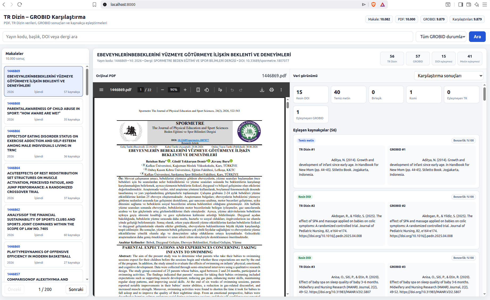
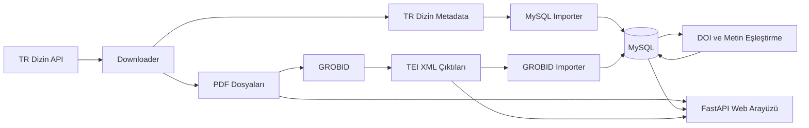

# TR Dizin – GROBID Kaynakça Karşılaştırma Sistemi

TR Dizin üzerinde yer alan akademik yayınların PDF dosyalarını indiren, kaynakçalarını GROBID ile yapılandırılmış TEI XML formatına dönüştüren ve elde edilen kaynakça verilerini TR Dizin kayıtlarıyla karşılaştıran Docker tabanlı bir veri işleme ve değerlendirme sistemi.

Proje; PDF indirme, akademik kaynakça çıkarımı, veritabanına aktarma, DOI ve metin benzerliği tabanlı eşleştirme, hata sınıflandırması ve web tabanlı inceleme arayüzünü tek bir Docker Compose mimarisi altında birleştirir.

> Bu proje akademik araştırma ve geliştirme amacıyla hazırlanmıştır. TR Dizin veya GROBID ekipleriyle resmî bir bağlantısı bulunmamaktadır.

## Web Arayüzü Görünümü



Arayüz; orijinal PDF dosyasını, TR Dizin kaynakçalarını, GROBID tarafından çıkarılan kaynakçaları ve eşleştirme sonuçlarını aynı ekran üzerinde inceleme imkânı sağlar.

---

## Projenin Amacı

Akademik makalelerde yer alan kaynakçaların otomatik olarak çıkarılması sırasında aşağıdaki problemler oluşabilir:

* Kaynakça başlıklarının eksik veya yanlış ayrıştırılması
* Birden fazla kaynakçanın tek kayıt olarak birleştirilmesi
* Tek bir kaynakçanın yalnızca bir bölümünün alınması
* DOI, yazar, yayın yılı veya dergi bilgilerinin bulunamaması
* Görüntü tabanlı PDF dosyalarının işlenememesi
* TR Dizin ve GROBID kaynakça sayılarının farklı olması

Bu proje, TR Dizin kaynakça verilerini karşılaştırma kaynağı olarak kullanarak GROBID tarafından çıkarılan kaynakçaları analiz etmeyi ve olası ayrıştırma hatalarını görünür hâle getirmeyi amaçlar.

---

## Temel Özellikler

* TR Dizin arama API’sinden yayın kayıtlarının alınması
* Açık erişimli PDF dosyalarının toplu olarak indirilmesi
* İndirme ilerlemesinin ve hataların kaydedilmesi
* İşlemin durdurulduğu yerden devam edebilmesi
* PDF dosyalarının GROBID ile işlenmesi
* Kaynakçaların TEI XML formatında oluşturulması
* TR Dizin makale verilerinin MySQL veritabanına aktarılması
* GROBID kaynakçalarının MySQL veritabanına aktarılması
* DOI tabanlı kesin kaynakça eşleştirmesi
* Metin benzerliği tabanlı kaynakça eşleştirmesi
* Birleşik ve kısmi GROBID kaynakçalarının sınıflandırılması
* OCR gerektiren veya işlenemeyen PDF dosyalarının belirlenmesi
* PDF, TR Dizin verisi, GROBID verisi ve karşılaştırma sonuçlarının web arayüzünde incelenmesi
* Bütün servislerin Docker Compose ile yönetilmesi

---

## Kullanılan Teknolojiler

| Teknoloji               | Kullanım amacı                                            |
| ----------------------- | --------------------------------------------------------- |
| Python                  | Veri indirme, işleme, aktarma ve eşleştirme işlemleri     |
| FastAPI                 | Web arayüzünün backend servisi ve API endpointleri        |
| Uvicorn                 | FastAPI uygulamasının çalıştırılması                      |
| MySQL 8.4               | Makale, kaynakça ve karşılaştırma sonuçlarının saklanması |
| GROBID 0.8.0            | PDF kaynakçalarının TEI XML formatında çıkarılması        |
| Docker                  | Servislerin izole container’larda çalıştırılması          |
| Docker Compose          | Birden fazla servisin birlikte yönetilmesi                |
| RapidFuzz               | Kaynakça metinlerinin benzerlik skorlarının hesaplanması  |
| HTML, CSS ve JavaScript | Karşılaştırma arayüzü                                     |
| Requests                | TR Dizin servisleriyle HTTP iletişimi                     |

---

## Sistem Mimarisi



### Temel veri akışı

1. TR Dizin API’sinden makale kayıtları alınır.
2. Uygun makalelerin PDF dosyaları indirilir.
3. Ham API cevapları metadata olarak saklanır.
4. PDF dosyaları GROBID servisine gönderilir.
5. GROBID, kaynakçaları TEI XML formatında üretir.
6. TR Dizin ve GROBID verileri MySQL veritabanına aktarılır.
7. Kaynakçalar önce DOI, ardından metin benzerliği ile eşleştirilir.
8. Sonuçlar web arayüzünde incelenir.

---

## Proje Yapısı

```text
trdizin-grobid-project/
├── database/
│   ├── init/
│   │   └── 001_schema.sql
│   ├── importer/
│   │   ├── import_articles.py
│   │   ├── import_failed_statuses.py
│   │   ├── import_grobid.py
│   │   ├── import_trdizin_references.py
│   │   ├── match_references.py
│   │   ├── match_references_full.py
│   │   ├── Dockerfile
│   │   └── requirements.txt
│   └── 002_insert_exact_doi_matches.sql
│
├── downloader/
│   ├── download_pdfs.py
│   ├── bulk_download_pdfs.py
│   ├── trdizin_api_test.py
│   ├── Dockerfile
│   └── requirements.txt
│
├── processor/
│   ├── process_pdfs.py
│   ├── classify_failed_pdfs.py
│   ├── Dockerfile
│   └── requirements.txt
│
├── worker/
│   ├── run_pipeline.py
│   └── Dockerfile
│
├── interface/
│   ├── app.py
│   ├── templates/
│   │   └── index.html
│   ├── Dockerfile
│   └── requirements.txt
│
├── data/
│   ├── pdfs/
│   ├── grobid-output/
│   ├── metadata/
│   ├── logs/
│   └── mysql/
│
├── .env.example
├── .gitignore
├── docker-compose.yml
└── README.md
```

`data/` klasörü çalışma sırasında üretilen PDF, XML, metadata, log ve veritabanı dosyalarını içerir. Bu klasör GitHub deposuna dâhil edilmez.

---

## Docker Servisleri

| Servis                          | Görevi                                                                      |
| ------------------------------- | --------------------------------------------------------------------------- |
| `grobid`                        | PDF kaynakçalarını TEI XML formatına dönüştürür                             |
| `mysql`                         | Makale ve kaynakça verilerini saklar                                        |
| `downloader`                    | Küçük ölçekli PDF indirme işlemi gerçekleştirir                             |
| `bulk-downloader`               | Belirlenen hedef sayıya kadar toplu PDF indirir                             |
| `processor`                     | PDF dosyalarını GROBID ile işler                                            |
| `grobid-worker`                 | İşlenmemiş PDF’leri gruplar hâlinde işler ve sonuçları veritabanına aktarır |
| `db-importer`                   | TR Dizin makale metadata kayıtlarını MySQL’e aktarır                        |
| `db-grobid-importer`            | GROBID TEI XML sonuçlarını MySQL’e aktarır                                  |
| `db-trdizin-reference-importer` | TR Dizin kaynakça kayıtlarını veritabanına aktarır                          |
| `db-reference-matcher`          | Sınırlı sayıda makalede kaynakça eşleştirme testi yapar                     |
| `db-reference-matcher-full`     | Uygun makalelerin tamamında kaynakça eşleştirmesi yapar                     |
| `failed-grobid-classifier`      | Başarısız veya OCR gerektiren PDF dosyalarını sınıflandırır                 |
| `db-grobid-status-importer`     | GROBID hata durumlarını veritabanına aktarır                                |
| `interface`                     | Karşılaştırma web arayüzünü çalıştırır                                      |

---

## Kurulum Gereksinimleri

Projeyi çalıştırmak için sistemde aşağıdaki araçların bulunması gerekir:

* Git
* Docker Engine
* Docker Compose

Kurulumun doğrulanması:

```bash
git --version
docker --version
docker compose version
```

---

## Projenin İndirilmesi

```bash
git clone https://github.com/gksukesenn/trdizin-grobid-project.git
cd trdizin-grobid-project
```

---

## Ortam Değişkenleri

Örnek ortam dosyasını kopyalayın:

```bash
cp .env.example .env
```

`.env` dosyasını açarak güvenli değerler belirleyin:

```env
MYSQL_ROOT_PASSWORD=change_this_root_password
MYSQL_DATABASE=trdizin_grobid
MYSQL_USER=trdizin_app
MYSQL_PASSWORD=change_this_application_password
```

Gerçek `.env` dosyası güvenlik nedeniyle GitHub deposuna gönderilmez.

---

## Veri Klasörlerinin Oluşturulması

```bash
mkdir -p data/pdfs
mkdir -p data/grobid-output
mkdir -p data/metadata
mkdir -p data/logs
mkdir -p data/mysql
```

---

## Temel Servislerin Başlatılması

MySQL, GROBID ve web arayüzünü başlatmak için:

```bash
docker compose up -d mysql grobid interface
```

Container durumlarını kontrol etmek için:

```bash
docker compose ps
```

GROBID servis kontrolü:

```bash
curl http://localhost:8070/api/isalive
```

Web uygulaması sistem kontrolü:

```bash
curl http://localhost:8000/api/health
```

---

## Web Arayüzü

Uygulama çalıştıktan sonra web arayüzüne tarayıcı üzerinden aşağıdaki yerel adresle erişilir:

```text
http://localhost:8000
```

Arayüzde aşağıdaki veriler görüntülenebilir:

* Makale listesi
* Makale başlığı, DOI, yıl ve dergi bilgisi
* Orijinal PDF
* TR Dizin kaynakçaları
* GROBID kaynakçaları
* TR Dizin ham JSON verisi
* GROBID ham TEI XML verisi
* DOI eşleşmeleri
* Metin benzerliği eşleşmeleri
* Birleşik kaynakçalar
* Kısmi kaynakçalar
* Eşleşmeyen TR Dizin kaynakçaları
* Eşleşmeyen GROBID kaynakçaları

---

## Küçük Ölçekli Test Akışı

Sınırlı sayıda PDF indirmek için:

```bash
docker compose run --rm downloader
```

İndirilen PDF dosyalarını GROBID ile işlemek için:

```bash
docker compose run --rm processor
```

TR Dizin makale kayıtlarını veritabanına aktarmak için:

```bash
docker compose run --rm db-importer
```

GROBID sonuçlarını veritabanına aktarmak için:

```bash
docker compose run --rm db-grobid-importer
```

TR Dizin kaynakçalarını veritabanına aktarmak için:

```bash
docker compose run --rm db-trdizin-reference-importer
```

Sınırlı sayıda makalede eşleştirme testi yapmak için:

```bash
docker compose run --rm db-reference-matcher
```

---

## Toplu İşleme Akışı

Toplu PDF indirme işlemi:

```bash
docker compose run --rm bulk-downloader
```

Varsayılan hedef sayı `docker-compose.yml` içerisinde aşağıdaki ortam değişkeniyle belirlenir:

```yaml
TARGET_COUNT: "10000"
```

PDF dosyalarını gruplar hâlinde GROBID ile işlemek ve sonuçları MySQL’e aktarmak için:

```bash
docker compose run --rm grobid-worker
```

Tam kaynakça eşleştirme işlemi:

```bash
docker compose run --rm db-reference-matcher-full
```

---

## Kaynakça Eşleştirme Yaklaşımı

Kaynakça eşleştirme işlemi iki temel aşamada gerçekleştirilir.

### 1. Kesin DOI eşleştirmesi

TR Dizin ve GROBID kaynakçalarında bulunan DOI değerleri normalize edilerek karşılaştırılır. Aynı DOI değerine sahip kayıtlar kesin eşleşme olarak değerlendirilir.

### 2. Metin benzerliği eşleştirmesi

DOI ile eşleşmeyen kaynakçalar normalize edilmiş ham kaynakça metinleri üzerinden karşılaştırılır.

Benzerlik hesabında aşağıdaki RapidFuzz yöntemleri birlikte kullanılır:

* `ratio`
* `token_sort_ratio`
* `token_set_ratio`

Kaynakça yayın yılları aynıysa benzerlik skoruna ek puan verilir. Yıllar farklıysa skor düşürülür.

Karşılıklı olarak birbirini en iyi aday olarak seçen ve belirlenen benzerlik eşiğini geçen kayıtlar eşleştirilir.

---

## Eşleştirme Sınıfları

| Durum              | Açıklama                                                              |
| ------------------ | --------------------------------------------------------------------- |
| `exact_match`      | DOI değerleri kesin olarak eşleşmiştir                                |
| `text_match_clean` | Kaynakça metinleri temiz biçimde eşleşmiştir                          |
| `grobid_merged`    | GROBID birden fazla kaynakçayı tek kayıt içinde birleştirmiş olabilir |
| `grobid_partial`   | GROBID kaynakçanın yalnızca bir bölümünü çıkarmış olabilir            |
| `unmatched`        | Uygun bir karşılık bulunamamıştır                                     |

---

## Başarısız PDF Sınıflandırması

Bazı PDF dosyaları doğrudan metin içermeyebilir veya GROBID tarafından işlenemeyebilir.

Başarısız dosyaları sınıflandırmak için:

```bash
docker compose run --rm failed-grobid-classifier
```

Sonuçları veritabanına aktarmak için:

```bash
docker compose run --rm db-grobid-status-importer
```

Olası durumlar:

* Başarıyla işlendi
* İçerik bulunamadı
* OCR gerekli
* Geçersiz PDF
* GROBID işlem hatası

---

## Log ve Durum Dosyaları

Çalışma sırasında aşağıdaki türlerde kayıtlar oluşturulur:

```text
data/logs/
data/metadata/
```

Toplu indirme işlemi:

* İndirilen dosyaları
* Atlanan dosyaları
* Başarısız istekleri
* Son işlenen sayfayı
* Son işlenen yayın kimliğini

kaydeder.

Bu sayede işlem durdurulduğunda veya bağlantı hatası oluştuğunda kaldığı noktadan devam edebilir.

---

## Veritabanı Yapısı

Projede temel olarak aşağıdaki tablolar kullanılır:

| Tablo                         | İçerik                                              |
| ----------------------------- | --------------------------------------------------- |
| `articles`                    | TR Dizin makale metadata kayıtları                  |
| `trdizin_references`          | TR Dizin kaynakça kayıtları                         |
| `grobid_documents`            | GROBID belge işleme durumları ve TEI XML içerikleri |
| `grobid_references`           | GROBID tarafından çıkarılan kaynakçalar             |
| `comparison_results`          | Kaynakça eşleştirme ve karşılaştırma sonuçları      |
| `reference_matching_progress` | Makale bazında eşleştirme ilerleme bilgileri        |

---

## Verilerin GitHub’a Eklenmemesi

Aşağıdaki dosyalar ve klasörler GitHub deposuna gönderilmez:

* İndirilen PDF dosyaları
* GROBID TEI XML çıktıları
* MySQL veri dosyaları
* Log dosyaları
* Metadata çıktıları
* `.env` dosyası
* Geçici ve yedek dosyalar

Bu dosyalar hem yüksek boyutlu olabilecekleri hem de çalışma ortamına özel bilgiler içerebilecekleri için `.gitignore` ile hariç tutulmuştur.

---

## Bilinen Sınırlamalar

* Görüntü tabanlı PDF dosyaları OCR işlemi olmadan işlenemeyebilir.
* Kaynakça biçimleri dergiler arasında farklılık gösterebilir.
* GROBID bazı kaynakçaları birleştirebilir veya kısmi çıkarabilir.
* Metin benzerliği eşikleri bütün yayın türlerinde aynı sonucu vermeyebilir.
* TR Dizin servislerinin hız veya erişim sınırları toplu indirme işlemini etkileyebilir.
* Büyük veri kümeleri önemli miktarda disk alanı kullanabilir.
* Canlı internet ortamında tam GROBID servisi çalıştırmak yüksek bellek gerektirebilir.

---

## Geliştirme Hedefleri

* OCR servisinin sisteme eklenmesi
* Alan bazlı doğruluk ölçümlerinin geliştirilmesi
* Başlık, yazar, yıl, dergi ve DOI için ayrı başarı oranlarının hesaplanması
* Değerlendirme sonuçlarının CSV ve JSON olarak dışa aktarılması
* Web arayüzünde gelişmiş filtreleme ve raporlama
* Docker healthcheck kapsamının genişletilmesi
* Otomatik testlerin eklenmesi
* CI/CD sürecinin kurulması
* Sınırlı veri içeren canlı demo ortamının hazırlanması
* Mimari ve veri akışı diyagramlarının geliştirilmesi

---

## Proje Durumu

Projenin mevcut sürümünde:

* Docker Compose mimarisi oluşturuldu.
* TR Dizin API bağlantısı gerçekleştirildi.
* Küçük ve toplu PDF indirme servisleri hazırlandı.
* GROBID servisi Docker ortamına eklendi.
* PDF kaynakçaları TEI XML formatında çıkarıldı.
* MySQL veritabanı ve tabloları oluşturuldu.
* TR Dizin ve GROBID verileri veritabanına aktarıldı.
* DOI ve metin benzerliği tabanlı eşleştirme geliştirildi.
* Birleşik ve kısmi kaynakça sınıflandırması eklendi.
* Hatalı PDF sınıflandırma akışı oluşturuldu.
* PDF ve karşılaştırma sonuçlarını gösteren web arayüzü geliştirildi.

Proje aktif olarak geliştirilmektedir.
# Temiz Klon Sunum Kurulumu

Bu proje canlı TR Dizin API'sinde makale arar, seçilen yayının PDF'sini belleğe alır ve doğrudan GROBID'e gönderir. Ana sunum akışı önceden indirilmiş PDF/XML/metadata veya dolu MySQL gerektirmez. Eski batch ve karşılaştırma araçları araştırma kullanımı için korunmuştur.

## Gereksinimler

- Git
- Docker Engine ve Docker Compose v2
- TR Dizin'e internet erişimi
- İlk image indirmeleri için yaklaşık birkaç GB boş alan (GROBID image'ı büyüktür)

## Klonlama ve ortam ayarı

```bash
git clone <repository-url>
cd trdizin-grobid-project
cp .env.example .env
```

`.env.example` yalnızca yerel geliştirme varsayılanları içerir. `.env` commit edilmez; production parolalarını burada verilen örneklerle kullanmayın.

## Docker ile çalıştırma

```bash
docker compose up -d --build mysql grobid interface
```

Arayüz: http://localhost:8000 — GROBID: http://localhost:8070

## Sağlık ve API testleri

```bash
curl --fail http://localhost:8000/api/health
curl --fail "http://localhost:8000/api/trdizin/articles/search?page=1&limit=10"
curl --fail "http://localhost:8000/api/trdizin/articles/1448395"
curl --fail "http://localhost:8000/api/trdizin/articles/1448395/references"
curl --fail --range 0-1023 \
  "http://localhost:8000/api/trdizin/articles/1448395/pdf" -o /tmp/article.part
curl --fail -X POST \
  "http://localhost:8000/api/trdizin/articles/1448395/process-and-compare"
```

Son komut TR Dizin ve GROBID canlı servislerini kullanır; ağ ve makale boyutuna göre sürebilir. Response içinde iki kaynakça listesi, `comparison` ve `tei_xml` bulunur. PDF `data/pdfs` altına, TEI de `data/grobid-output` altına yazılmaz.

## Log, durdurma ve debug

```bash
docker compose logs -f interface grobid
docker compose stop interface grobid mysql
```

Kod değişiklikleriyle debug etmek için interface'i yerelde veya IDE içinde `interface/app.py:app` üzerinden Uvicorn ile çalıştırın; `GROBID_URL=http://localhost:8070` ayarlayın. Önerilen breakpoint ve değişkenler [DEBUG_AKIS_REHBERI.md](DEBUG_AKIS_REHBERI.md) dosyasındadır. Sunum özeti için [SUNUM_NOTLARI.md](SUNUM_NOTLARI.md) dosyasına bakın.

## Sunum API mimarisi

```text
FastAPI route → use case → port ← HTTP adapter
```

- Route: HTTP doğrulaması ve hata/status dönüşümü
- Use case: arama, detay ve PDF → GROBID iş akışı
- Port: dış servislerden bağımsız sözleşme
- Adapter: TR Dizin/GROBID URL, HTTP, timeout, retry ve response ayrıştırma

---
